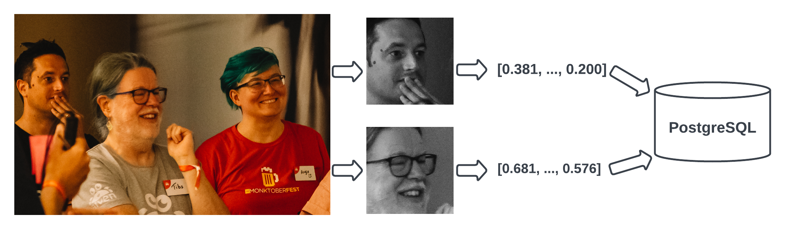

How I used PostgreSQL\ :sup:`®` to find pictures of me at a party
==================================================================

.. class:: title-slide-info

    By Tibs (they / he)

    Slides and source code at
    https://github.com/aiven-labs/pgvector-find-faces-talk

.. footer::

   *tony.ibbs@aiven.io* / *https://aiven.io/tibs*  / *@much_of_a*

Broad structure
---------------

Introduction and vague background

Not an explanation of ML

Finding pictures of me

Why PostgreSQL\ :sup:`®`.

Part the first: Introduction and vague background
-------------------------------------------------

I'm Tibs_, and I'm a Developer Educator at Aiven_:

  Aiven: Your trusted data and AI platform

  (One unified platform to stream, store, and serve data on any cloud)

.. _Aiven: https://aiven.io/
.. _Tibs: https://aiven.io/tibs

Last year, our engineering colleagues enabled the ``pgvector`` plugin for
PostgreSQL\ :sup:`®` on our platform, and my other colleagues started playing
with it. In particular, `Francesco Tisiot`_ wrote a tutorial on how to use it.

I'm a recovering AI skeptic
~~~~~~~~~~~~~~~~~~~~~~~~~~~

I lived through the `AI boom`_ in the 1980s, and the subsequent `AI winter`_ of the 1990s

But we did get expert systems, knowledge based systems, etc. - they just dropped the name "AI"

.. _`AI boom`: https://en.wikipedia.org/wiki/History_of_artificial_intelligence#Boom_(1980%E2%80%931987)
.. _`AI winter`: https://en.wikipedia.org/wiki/AI_winter

My colleagues had been convincing me
~~~~~~~~~~~~~~~~~~~~~~~~~~~~~~~~~~~~

Interesting used of ChatGPT and friends:

* Quick prototypes of boring code
* Rewrite this paragraph a different way

But what first really caught my interest was this use case, finding my face,
which is based on a tutorial by `Francesco Tisiot`_. And yes, he used my face
in the tutorial :)

Since then, I've found other compelling use cases, including:

* Search and RAG patterns (Retrieval Augmented Generation)
* Multi-modal comparisons - comparing text, audio, image and video.

The talk title says "how I used", but it should probably be "how I'm learning
to use" - this is still very much something I'm learning about, and this talk
is only partway through my journey

As medical doctors say:

* See one
* Do one
* Teach one

(which is appropriately scary!)

But yes, one good way of figuring out just that bit more about a process is to
get to the stage where you can give a talk on it.

Part the second: not an explanation of ML
-----------------------------------------

    Photo by `Markus Winkler`_ on Unsplash_

.. _`Markus Winkler`: https://unsplash.com/@markuswinkler?utm_source=unsplash&utm_medium=referral&utm_content=creditCopyText

.. _Unsplash: `ML Typewriter`_
.. _`ML Typewriter`:
   https://unsplash.com/photos/f57lx37DCM4?utm_source=unsplash&utm_medium=referral&utm_content=creditCopyText

Vector embeddings
-----------------

Machine Learning people talk about vectors and embeddings and vector embeddings.

A vector is an array of numbers representing a direction and a size (or distance).

"Embedding" means representing something in a computer.

So a "vector embedding" is

* an array of numbers representing a direction and size
* stored in a computer.

Not an introduction to vectors and embeddings
---------------------------------------------

That's (at least) a whole other talk!

Broadly, we can describe the characteristics of things with numbers.

For instance, we can describe colours with RGB values (and some colours will
have the same representation), but also (thinking of
an XKCD post) with whether men tend to use that colour name or not.

Or we can describe words with their category of meaning, their part of speech,
and how likely they are to have another word following them.

Or we might describe a picture by it's dominant colours, whether it has
"feathery" or "scaly" parts, whether there are large blocks of particular
colours.

Once we've made such descriptions, we can treat the resultant array of numbers
as a **vector**, and we know how to do lots of interesting mathematics on
vectors.

For instance, considering the RGB case, we have an our RGB value is
essentially an X, Y, Z value, and we can treat the vector for our colour
being::

  (0, 0, 0) -> (R, G, B)

In different words, we can draw an arrow starting at ``(0, 0, 0)`` that goes to
``(R, G, B)``. That gives us a *direction* (in 3d space, because we have 3 values
that can change) and also a length (the length of the arrow).

For instance, we could represent ``(5, 8, 3)`` as follows (``origin`` is ``(0, 0, 0)``)

    **A 3d graph showing a vector (5, 8, 3)**

    .. image:: images/3d-vector.png
        :width: 50%

    Image from http://jccc-mpg.wikidot.com/the-vector-class, `CC BY-SA 3.0`_

    .. _`CC BY-SA 3.0`: https://creativecommons.org/licenses/by-sa/3.0/

It may seem a bit odd to turn our RGB "points" into vectors (arrows) in this
way, but that's because we can then use vector maths to compare two different
colours - for instance, are they going in more-or-less the same direction, are
they of similar lengths, and so on.

    **We can do mathematics with vectors**

    We can compare their

    * length
    * direction

    and we can do maths between vectors - but look elsewhere for that

.. Comment to split the text
..

   **Note** On the "do maths between vectors" - you can ask questions like:

   * "is the vector between colour 1 and colour 2 *similar to* the vector
     between colour 3 and colour 4",

   * "what is the colour that relates to colour 3 in the same way that colour
     2 relates to colour 1".

   but that's way beyond the scope of this talk.

This gets harder to think about when there are more values in our vector!

So once we've got vectors, we can compare them.

    **Calculating the vectors**

    Possible to do by hand for relatively simple cases

        (for instance, in early text analysis)

    but with ML, we can

    * *train* a machine learning system
    * to *"recognise"* that a thing belongs to particular categories.

    This is wonderful - and sometimes leads to surprising results

If you're interested in earlier versions of text analysis, look for NLP
(Natural Language Processing).

**Categorising** things to get those arrays is possible to do by hand for
relatively simple cases (people have done this in text analysis, for
instance), but what ML has given us is the ability to *train* a machine
learning system to "recognise" that a thing belongs to particular categories.

This is wonderful - it allows us to categorise things like images, allowing us
to find faces and all sorts of things.

We do, however, need to remember that the system will only work out categories
as it has been taught - and with ML, not all of those categories are one's we
can tell are there. This is why we get problems like a system being good at
recognising faces, but only if they belong to white men. It's also why we can
be surprised when a picture is recognised as a turtle when there are no
turtles in it - something we didn't expect is "similar" to something in the
training pictures, and it's not the thing we hoped for.

See the `References for future reading`_ at the end.

And note the quotation marks around *recognise* - it's very tempting to
anthropomorphise ML software, but it's not actually recognising anything, it's
just performing calculations.

Part the third: Finding pictures of me
--------------------------------------

.. image:: images/slack-picture.jpg

Disclaimer: not as many pictures as you expect
----------------------------------------------

Since many of the photographs would contain other people

(and I'd need their consent to show them)

Our aim
-------

Find which files contain my face, using SQL like the following:

.. code:: sql

    SELECT filename FROM pictures
      ORDER BY embedding <-> [0.38162553310394287, ..., 0.20030969381332397]
      LIMIT 10;

Based on a tutorial
-------------------

See

* The original tutorial, `Image recognition with Python, OpenCV, OpenAI CLIP
  and pgvector`_
* The GitHub repository with `a Jupyter notebook`_ showing working code for that tutorial: https://github.com/Aiven-Labs/pgvector-image-recognition

.. _`Image recognition with Python, OpenCV, OpenAI CLIP and pgvector`: https://aiven.io/developer/find-faces-with-pgvector
.. _`a Jupyter notebook`: https://github.com/Aiven-Labs/pgvector-image-recognition/blob/main/main.ipynb

In *this* repository:

* `find_faces.py`_ is my version of the initial piece of code, from `Retrieve
  the faces from the photos`_, and with my own adjustments to the
  ``haar_cascade.detectMultiScale`` settings.

* `calc_embeddings.py`_ is my version of the second piece of code, from
  `Calculate the embeddings`_.

* `find_faces_store_embeddings.py`_ and `find_nearby_faces.py`_ are then the
  convenience scripts I wrote to manage the final part of the tutorial,
  actually scanning a directory of images to find the faces therein (the first
  script) and to find (for instance) my face (the second script).

.. _`find_faces.py`: ../src/find_faces.py
.. _`calc_embeddings.py`: ../src/calc_embeddings.py
.. _`Retrieve the faces from the photos`:
   https://aiven.io/developer/find-faces-with-pgvector#retrieve-the-faces-from-photos
.. _`Calculate the embeddings`:
   https://aiven.io/developer/find-faces-with-pgvector#calculate-the-embeddings
.. _`find_faces_store_embeddings.py`: ../src/find_faces_store_embeddings.py
.. _`find_nearby_faces.py`: ../src/find_nearby_faces.py

1. Finding faces and store their embeddings
-------------------------------------------

The first process we want is one that finds the faces in an image, calculates
the embedding for each face, and stores that (along with other information) in
our PostgreSQL database.

But it's not perfect!
---------------------

In the photo in the previous slide, it only found two faces.

And when analysing another group photo, it also found these two *not* faces:

.. raw:: pdf

    Spacer 0 50

.. |not-a-face| image:: images/not-a-face.png
                        :width: 256

.. |not-a-face2| image:: images/not-a-face2.png
                        :width: 256

|not-a-face| |not-a-face2|

768 floating point numbers
--------------------------

The embedding is an array of 768 floating point numbers.

  ``0.38162553310394287, ..., 0.20030969381332397``

We *could* print that array out, or save it to a text file, and then copy if
when we want to do something with it. But we have a database, so let's use it
(in fact, this is already our first good reason for reaching for PostgreSQL).

   ** Note** Why 768? Some searching gave me `this answer on stackoverflow`_,
   which says:

     768 comes from the embedding of ViT used by CLIP. In ViT, it transform
     the input image of 224 * 224 pixels, to patches of size 16 * 16 pixels.
     Therefore, when you embed (flatten and use an MLP) the patches with size
     16 * 16 * 3 (RGB) = 768.

.. _`this answer on stackoverflow`: https://stackoverflow.com/questions/75693493/why-the-text-embedding-or-image-embedding-generated-by-clip-model-is-768-%C3%97-n#:~:text=768%20comes%20from%20the%20embedding,3%20(RGB)%20%3D%20768.

2. Looking for photos with my face in them
-------------------------------------------

The second process we want is one that, given a face, calculates its embedding
and then finds the most "similar" faces in the PostgreSQL database.

.. image:: images/find-nearby-faces.png
           :width: 100%

The example here is using my slack image as the reference face (note: those
numbers are not from its actual embedding!)

The program requirements
------------------------

We're going to be using

* `opencv-python`_ to find faces
* imgbeddings_ to calculate embeddings from an image

We also need to download the ::

  haarcascade_frontalface_default.xml

file from the `OpenCV GitHub repository`_ - this is the pre-trained Haar
Cascade model that we will use to recognise faces.

 **Note** Haar Cascade is designed to detect objects in images, regardless of
 their scale and location in those images. The article `Face Detection with
 Haar Cascade`_ describes how a Haar Cascade model recognises faces.

.. _`Face Detection with Haar Cascade`: https://towardsdatascience.com/face-detection-with-haar-cascade-727f68dafd08

My example programs also use click_ and `psycopg2-binary`_

.. _`opencv-python`: https://pypi.org/project/opencv-python/
.. _imgbeddings: https://github.com/minimaxir/imgbeddings
.. _click: https://click.palletsprojects.com/
.. _`psycopg2-binary`: https://pypi.org/project/psycopg2-binary/
.. _`OpenCV GitHub repository`: https://github.com/opencv/opencv/tree/master/data/haarcascades

Start a PostgreSQL service
--------------------------

For convenience, I use an Aiven for PostgreSQL\ :sup:`®` service. You can
create one within a few minutes using the `Aiven Console`_.

If you're new to Aiven, you can either use a free PostgreSQL or start a trial.
Either way, a Hobbyist plan should be sufficient for these examples.

.. _`Aiven Console`: https://console.aiven.io/

I like to use psql to communicate with the PostgreSQL service, but there are
other good choices. See the **Quick connect** button on the Aiven Console
service Overview page for suggestions as to what command lines to use to
connect to the database.

For convenience running the programs, I set the environment variable
``PG_SERVICE_URI`` to the value given for the Service URI on the service
Overview page. All of the programs will use this environment varaiable if it's
set.

Enable pgvector
---------------

Enable the pgvector extension:

.. code:: sql

   CREATE EXTENSION vector;

This only works if the ``pgvector`` extension is installed.

It may already be available, as is the case with Aiven for
PostgreSQL\ :sup:`®`.

See the `Installation instructions`_ on the `pgvector GitHub page`_, which
give some indication of whether it's likely to be available, and how to
install it if not.

.. _`Installation instructions`: https://github.com/pgvector/pgvector#installation
.. _`pgvector GitHub page`: https://github.com/pgvector/pgvector

Create our database table
-------------------------

.. code:: sql

   CREATE TABLE pictures (face_key text PRIMARY KEY, filename text, embedding vector(768));

* ``face`` is the string we use to identify this particular face:

    ``2023-04-26_170836174_104-1075-260-260``

    It's the base (stem) of the filename, plus the location and dimensions of
    the face in the original file. We use this as our primary key.

* ``filename`` is the name of the file we found the face in:

    ``2023-04-26_170836174.png``

    We want this so we can report the file without needing to work it out from
    the ``face``.

* ``embedding`` is the vector itself, the vector of dimension 768.

Find faces and store their embeddings
-------------------------------------

``find_faces_store_embeddings.py``

::

    Usage: find_faces_store_embeddings.py [OPTIONS] IMAGE_FILES...

    Options:
    -p, --pg-uri TEXT  the URI for the PostgreSQL service, defaulting to
                        $PG_SERVICE_URI if that is set
    --help             Show this message and exit.

Reminder: we're doing this sequence

Find faces and store their embeddings (1)
-----------------------------------------

.. code:: python

    def main(image_files: tuple[str], pg_uri: str):
        haar_cascade = load_algorithm()
        ibed = imgbeddings()

        for image_file in image_files:
            with psycopg2.connect(pg_uri) as conn:
                orig_image = cv2.imread(picture_file, cv2.IMREAD_GRAYSCALE)
                faces = find_faces(orig_image, haar_cascade)

                write_faces_to_pg(faces, orig_image, picture_file, conn, ibed)

``cv2`` is the OpenCV package

Find faces and store their embeddings (2)
-----------------------------------------

.. code:: python

    def load_algorithm():
        algorithm = "haarcascade_frontalface_default.xml"
        haar_cascade = cv2.CascadeClassifier(algorithm)
        if haar_cascade.empty():
            raise GiveUp(f'Error reading algorithm file {algorithm} - no algorithm found')
        return haar_cascade

Find faces and store their embeddings (3)
-----------------------------------------

.. code:: python

        # Read the image as greyscale
        orig_image = cv2.imread(image_file, cv2.IMREAD_GRAYSCALE)

**Note** in the original code as described in the slides at PyCon UK, this
code looked like:

.. code:: python

                orig_image = cv2.imread(image_file, 0)
                gray_image = cv2.cvtColor(orig_image, cv2.COLOR_RGB2BGR)

and there was a comment about converting to greyscale. This was wrong
(although it was consistently wrong, so the program did work!) in two ways:

1. ``cv2.COLOR_RGB2BGR`` not converting to greyscale (!) but from RGB to BGR
   colour order, and
2. that ``0`` parameter to the ``cv2.imread`` call is the same as the
   ``cv2.IMREAD_GRAYSCALE`` constant - so we're actually reading the file in
   as greyscale.

I've kept the original slides as-is (look for ``slides-at-pyconuk``), since
that's the version given there, but corrected the ``slides.rst`` version.

Find faces and store their embeddings (4)
-----------------------------------------

.. code:: python

    def find_faces(gray_image, haar_cascade):
        return haar_cascade.detectMultiScale(
            gray_image,
            scaleFactor=1.05,
            minNeighbors=2,
            minSize=(250, 250),
            #minSize=(100, 100),
        )

Find faces and store their embeddings (5)
-----------------------------------------

.. code:: python

    def write_faces_to_pg(faces, orig_image, picture_file, conn, ibed):
        file_path = Path(picture_file)
        file_base = file_path.stem
        file_posix = file_path.as_posix()

        for x, y, w, h in faces:
            # Convert to a Pillow image since that's what imgbeddings wants
            cropped_image = Image.fromarray(orig_image[y: y + h, x: x + w])
            embedding = ibed.to_embeddings(cropped_image)[0]
            face_key = f'{file_base}-{x}-{y}-{w}-{h}'

            write_to_pg(conn, face_key, file_posix, embedding)

We wrap the cropped image up as a Pillow ``Image``, since that's
what ``ibed.to_embeddings`` wants.

We *could* look for an image embedding library that doesn't expect an
``Image``, but it's not worth it for this tutorial (and it's not a big
issue).

Find faces and store their embeddings (6)
-----------------------------------------

And here's where we actually write to PostgreSQL

.. code:: python

    def write_to_pg(conn, face_key, file_name, embedding):
        with conn.cursor() as cur:
            cur.execute('INSERT INTO pictures (face_key, filename, embedding)'
                        ' VALUES (%s,%s,%s)'
                        ' ON CONFLICT (face_key) DO UPDATE'
                        '   SET filename = EXCLUDED.filename,'
                        '       embedding = EXCLUDED.embedding'
                        ';',
                        (face_key, file_name, embedding.tolist())
                        )

I *could* do better connection management, but I found that if I tried to use
one connection for ALL the files, the connection tends to get terminated, and
I couldn't be bothered to sort that out properly for a test.

  **Note** Running this over 570-ish decent sized photos took me 8-9 minutes,
  which is acceptable for just playing.

Find faces and store their embeddings (7)
-----------------------------------------

``ON CONFLICT`` is interesting:

.. code:: sql

     ON CONFLICT (face_key) DO UPDATE
        SET filename = EXCLUDED.filename,
            embedding = EXCLUDED.embedding;

The ``ON CONFLICT`` clause allows us to overwrite a record if it already
exists - this is useful when I might want to run the same script in testing
more than once, without wanting to ``DELETE FROM pictures;`` each time, to
delete the table content.

Running it
----------

::

  $ ./find_faces_store_embeddings.py ~/data/crab-week-2023-wednesday/*
  None of PyTorch, TensorFlow >= 2.0, or Flax have been found. Models won't be available and only tokenizers, configuration and file/data utilities can be used.
  None of PyTorch, TensorFlow >= 2.0, or Flax have been found. Models won't be available and only tokenizers, configuration and file/data utilities can be used.
  Loading imgbeddings
  /Users/tony.ibbs/sw/aiven/Aiven-Labs/pgvector-find-faces-talk/src/venv/lib/python3.11/site-packages/huggingface_hub/file_download.py:671: FutureWarning: 'cached_download' is the legacy way to download files from the HF hub, please consider upgrading to 'hf_hub_download'
    warnings.warn(
  /Users/tony.ibbs/sw/aiven/Aiven-Labs/pgvector-find-faces-talk/src/venv/lib/python3.11/site-packages/transformers/models/clip/processing_clip.py:149: FutureWarning: `feature_extractor` is deprecated and will be removed in v5. Use `image_processor` instead.
    warnings.warn(
  Processing /Users/tony.ibbs/data/crab-week-2023-wednesday/AIVEN2597.jpg
  Found 5 "faces" in /Users/tony.ibbs/data/crab-week-2023-wednesday/AIVEN2597.jpg
  Processing /Users/tony.ibbs/data/crab-week-2023-wednesday/AIVEN2598.jpg
  Found 5 "faces" in /Users/tony.ibbs/data/crab-week-2023-wednesday/AIVEN2598.jpg
  ...
  Found 8 "faces" in /Users/tony.ibbs/data/crab-week-2023-wednesday/AIVEN3654.jpg
  Processing /Users/tony.ibbs/data/crab-week-2023-wednesday/Copy of AIVEN2685.jpg
  Found 3 "faces" in /Users/tony.ibbs/data/crab-week-2023-wednesday/Copy of AIVEN2685.jpg
  Found 5006 "faces" in 779 files

which took 11m26s.

Find "nearby" faces
-------------------

``find_nearby_faces.py``

::

    Usage: find_nearby_faces.py [OPTIONS] FACE_FILE

    Options:
    -n, --number-matches INTEGER
    -p, --pg-uri TEXT             the URI for the PostgreSQL service, defaulting
                                  to $PG_SERVICE_URI if that is set
    --help                        Show this message and exit.

Reminder: we're doing this sequence

.. image:: images/find-nearby-faces.png
           :width: 100%

The original tutorial suggested calculating the embedding for the reference
face, and then passing it to the "find" script by hand. That's a pain (768
floating point numbers!) so it's easier to program it.

For laziness, my current script calculates the embedding for the reference
face each time it's run. That's really pretty awful <smile>

- I could store it in the database, and look its embedding up
- but I'd either have to make sure to ignore it when searching
- or I'd have to store it in a different table (perhaps the ideal)
- and I couldn't be bothered for this talk <sad-face>

Find "nearby" faces (1)
-----------------------

.. code:: python

    def main(face_file: tuple[str], number_matches: int, pg_uri: str):
        haar_cascade = load_algorithm()
        ibed = imgbeddings()

        # Calculate the embedding for the face file - we assume only one face
        embedding = calc_reference_embedding(face_file, haar_cascade, ibed)

        # Convert to something that will work in SQL
        vector_str = ", ".join(str(x) for x in embedding.tolist())
        vector_str = f'[{vector_str}]'

        ask_pg_and_report(pg_uri, vector_str, number_matches)

The start, loading the algorithm and ``imgbeddings``, should be familiar from
the previous program.

Find "nearby" faces (2)
-----------------------

.. code:: python

    def calc_reference_embedding(face_file, haar_cascade, ibed):
        orig_image = cv2.imread(image_file, cv2.IMREAD_GRAYSCALE)
        faces = find_faces(gray_image, haar_cascade)

        # We hope there's only one face!
        cropped_images = []
        for x, y, w, h in faces:
            cropped_images.append(orig_image[y : y + h, x : x + w])

        face = Image.fromarray(cropped_images[0])
        return ibed.to_embeddings(face)[0]

This is very similar to what we had before, except we're only expecting one
face, the reference face.

Find "nearby" faces (3)
-----------------------

In fact, in the real code it doesn't say:

.. code:: python

        # We hope there's only one face!

I couldn't resist an actual check:

.. code:: python

        if len(faces) == 0:
            raise GiveUp(f"Didn't find any faces in {face_file}")
        elif len(faces) > 1:
            raise GiveUp(f"Found more than one face in {face_file}")

Find "nearby" faces (4)
-----------------------

Our embedding needs turning into something that SQL will understand:

.. code:: python

    vector_str = ", ".join(str(x) for x in embedding.tolist())
    vector_str = f'[{vector_str}]'

Find "nearby" faces (5)
-----------------------

.. code:: python

    def ask_pg_and_report(pg_uri, vector_str, number_matches):
        with psycopg2.connect(pg_uri) as conn:
            with conn.cursor() as cur:
                cur.execute(
                    "SELECT filename FROM pictures ORDER BY embedding <-> %s LIMIT %s;",
                    (vector_str, number_matches)
                )
                rows = cur.fetchall()
            print(f'Number of results: {len(rows)}')
            for index, row in enumerate(rows):
                print(f'  {index}: {row[0]}')

This is why I stored the original filename in the database table - so I could
use it in the report at the end.

Find "nearby" faces (6)
-----------------------

That SQL operator:

.. code:: sql

    SELECT filename FROM pictures
      ORDER BY embedding <-> [0.38162553310394287, ..., 0.20030969381332397]
      LIMIT 10;

* `<->` finds the nearest results by L2 (euclidean) distance.
* `<=>` uses cosine similarity - it compares the angle/direction
* `<#>` computes the inner product - do the vectors point the same way
* `<+>` computes the L1 ("Manhattan" or "taxi cab") distance (new in 0.7.0)

See the pgvector `Querying`_ documentation for the current list of operators.

.. _`Querying`: https://github.com/pgvector/pgvector?tab=readme-ov-file#querying

Running it
----------

::

  $ ./find_nearby_faces.py slack-picture.jpg -n 10
  None of PyTorch, TensorFlow >= 2.0, or Flax have been found. Models won't be available and only tokenizers, configuration and file/data utilities can be used.
  None of PyTorch, TensorFlow >= 2.0, or Flax have been found. Models won't be available and only tokenizers, configuration and file/data utilities can be used.
  Loading imgbeddings
  /Users/tony.ibbs/sw/aiven/Aiven-Labs/pgvector-find-faces-talk/src/venv/lib/python3.11/site-packages/huggingface_hub/file_download.py:671: FutureWarning: 'cached_download' is the legacy way to download files from the HF hub, please consider upgrading to 'hf_hub_download'
    warnings.warn(
  /Users/tony.ibbs/sw/aiven/Aiven-Labs/pgvector-find-faces-talk/src/venv/lib/python3.11/site-packages/transformers/models/clip/processing_clip.py:149: FutureWarning: `feature_extractor` is deprecated and will be removed in v5. Use `image_processor` instead.
    warnings.warn(
  Number of results: 10
    0: /Users/tony.ibbs/data/crab-week-2023-wednesday/AIVEN2752.jpg
    1: /Users/tony.ibbs/data/crab-week-2023-wednesday/AIVEN2839.jpg
    2: /Users/tony.ibbs/data/crab-week-2023-wednesday/AIVEN2838.jpg
    3: /Users/tony.ibbs/data/crab-week-2023-wednesday/AIVEN2806.jpg
    4: /Users/tony.ibbs/data/crab-week-2023-wednesday/AIVEN2808.jpg
    5: /Users/tony.ibbs/data/crab-week-2023-wednesday/AIVEN2750.jpg
    6: /Users/tony.ibbs/data/crab-week-2023-wednesday/AIVEN2751.jpg
    7: /Users/tony.ibbs/data/crab-week-2023-wednesday/AIVEN2748.jpg
    8: /Users/tony.ibbs/data/crab-week-2023-wednesday/AIVEN2681.jpg
    9: /Users/tony.ibbs/data/crab-week-2023-wednesday/AIVEN3104.jpg

which took 3s

But how good is it?
-------------------

Well, the search is quick, which is satisfying.

(Something like 3 seconds to compare the embeddings for 5000 faces from 750+ photos)

Wednesday at Crab Week
----------------------

779 files, 5006 faces

* Between 11 and 21 minutes to calculate and store the embeddings

* 3 seconds to find the 10 nearest faces

Which I think is perfectly acceptable for demo software.

Going through the files manually, I found 25 that had me in them,
but some were in a crowd or obscured, three were of my back (!) and two were
with a false moustache

Results the program found
-------------------------

And here are the first 10 matches from the program

::

    AIVEN2752.jpg -- just me
    AIVEN2839.jpg -- just me
    AIVEN2838.jpg -- just me
    AIVEN2806.jpg -- me in front of audience
    AIVEN2808.jpg -- just me, from side
    AIVEN2750.jpg -- me plus another
    AIVEN2751.jpg -- me plus others
    AIVEN2748.jpg -- me plus others
    AIVEN2681.jpg -- me in group sitting
    AIVEN3104.jpg -- not me, beard and glasses

The first of those, AIVEN2752 (some redaction on the whiteboard):

.. image:: images/AIVEN2752.jpeg
           :width: 30%

Me in a group, AIVEN2751 (again, some redaction of the whiteboard, and also
people's faces hidden):

.. image:: images/AIVEN2751.png
           :width: 60%

The "find faces" program actually found 5 "faces" in that photo - the extra
two were both parts of the text on the whiteboard.

If I asked the program for the first 20 matches, I'd get::

  AIVEN2752.jpg -- as above, just me
  AIVEN2839.jpg -- as above, just me
  AIVEN2838.jpg -- as above, just me
  AIVEN2806.jpg -- as above, me in front of audience
  AIVEN2808.jpg -- as above, just me, from side
  AIVEN2750.jpg -- as above, me plus another
  AIVEN2751.jpg -- as above, me plus others
  AIVEN2748.jpg -- as above, me plus others
  AIVEN2681.jpg -- as above, me in group sitting
  AIVEN3104.jpg -- as above, not me, beard and glasses
  AIVEN2944.jpg -- me, dark glasses & hat, with others
  AIVEN2806.jpg -- as above, me in front of audience
  AIVEN3088.jpg -- not me
  AIVEN3298.jpg -- not me, but a confusing picture! (fake moustaches)
  AIVEN2945.jpg -- me, dark glasses & hat, with others
  AIVEN2796.jpg -- not me, beard and glasses (Claude)
  AIVEN2995.jpg -- not me, beard and glasses
  AIVEN2795.jpg -- not me, beard and glasses (Claude)
  AIVEN3452.jpg -- not me, beard and glasses, dark conditions
  AIVEN3333.jpg -- not me, beard and glasses (twice)

and *my* list from that day was::

  AIVEN2678.jpg -- side view of me in audience
  AIVEN2679.jpg -- view of me, small, in audience
  AIVEN2681.jpg -- FOUND
  AIVEN2748.jpg -- FOUND
  AIVEN2750.jpg -- FOUND
  AIVEN2751.jpg -- FOUND
  AIVEN2752.jpg -- FOUND
  AIVEN2805.jpg -- distance view of me before audience
  AIVEN2806.jpg -- FOUND
  AIVEN2808.jpg -- FOUND
  AIVEN2809.jpg -- side view of me
  AIVEN2838.jpg -- FOUND
  AIVEN2839.jpg -- FOUND
  AIVEN2944.jpg -- FOUND
  AIVEN2945.jpg -- me, dark glasses & hat, with others
  AIVEN2945.png -- FOUND
  AIVEN2952.jpg -- my back!
  AIVEN3031.jpg -- my back in a crowd
  AIVEN3034.jpg -- me in a group
  AIVEN3037.jpg -- me in a group
  AIVEN3040.jpg -- side view of me in a group
  AIVEN3054.jpg -- me, obscured
  AIVEN3311.jpg -- me with hat and false moustache
  AIVEN3313.jpg -- me with hat and false moustache and others
  AIVEN3385.jpg -- my back

Thursday at Crab Week
---------------------

There were 574 photos.

Going through them manually, I found 7 that had my face visible, although in 4
of them I had dark glasses

::

    AIVEN3697.jpg  -- clearly me
    AIVEN3739.jpg  -- me
    AIVEN3797.jpg  -- me looking down with a hat and dark glasses
    AIVEN3798.jpg  -- me with a hat and dark glasses
    AIVEN3933.jpg  -- me looking down, slightly sideways
    AIVEN4277.jpg  -- crowd photo, me with hair down and dark glasses
    AIVEN4281.jpg  -- crowd photo, me with hair down and dark glasses

(I also found group photos and other views that I knew from context had me in
them - that's not something in scope here!)

And here are the first 10 matches from the program

::

   AIVEN3933.jpg  -- me
   AIVEN3697.jpg  -- me
   AIVEN3670.jpg  -- not me, but sort of understandable - beard & glasses
   AIVEN3760.jpg  -- not me, but sort of understandable - beard & glasses
   AIVEN3671.jpg  -- not me, but sort of understandable - beard & glasses
   AIVEN3739.jpg  -- me
   AIVEN3673.jpg  -- not me, but sort of understandable - beard & glasses
   AIVEN3999.jpg  -- not me, but sort of understandable - beard & glasses
   AIVEN4316.jpg  -- not me, but sort of understandable - beard & (dark) glasses
   AIVEN3679.jpg  -- not me, but sort of understandable - beard & glasses

So it's found 3 of the pictures I'd hope it might, with the first being
``AIVEN3933.jpg``, which has me looking down - slightly surprising.

Here's a version of that with other faces hidden:

The "find faces" program found 24 "faces" in that picture, some of which were
faces or parts of faces (sometimes the same person) and some of which were
difficult to say. It didn't find all of the faces I might have hoped it would.

The "not me, but sort of understandable" results have someone with a beard in
them <smile>. Of course, it's an *assumption* that the "nearness" is being
done for reasons that "make sense" to us <smile>

And luckily for my piece of mind, it did find the photo found in the tutorial.
Here's part of it, cropped just to show the people who gave permission to show
their faces:

.. image:: images/AIVEN3739-cropped.jpg

Ideally, I'd go on and try different tuning factors in the embedding
calculations, and see how that affects things.

   **Note** If I intended to do that a lot, I'd probably want to

   1. give the scripts a switch to allow setting the parameters
   2. either have a database table for each set of parameters, so I could
      search only in the correct table, or put the parameters (perhaps just as
      a single string column) into the table, so I could make the SQL only
      look at appropriate records.

   If I don't do 1, then I'll need to edit the program each time, and if I
   don't do 2, then I'll need to ``DELETE FROM pictures`` each time, and
   moreover I'll need to rerun the "calculate and store embeddings" step if I
   want to re-investigate older embeddings.

So was this a success, so far?
------------------------------

Definitely yes.

I learnt a lot.

I got not awful (!) results with really very low effort.

I know what to do for the next set of investigations, and the data I collect
will be persistent, too.

And my colleague, meanwhile, has been getting great success in using the same
technique to distinguish chihuahuas and muffins:

  https://twitter.com/FTisiot/status/1697589937317564635

  Trying out #PostgreSQL #pgvector on the famous “`Chihuahua vs muffin dataset`_”, results are very good!

.. _`Chihuahua vs muffin dataset`:
   https://www.kaggle.com/datasets/samuelcortinhas/muffin-vs-chihuahua-image-classification

What I'd do next
----------------

Improve ``find_faces_store_embeddings.py``:

* Add a switch to allow playing with the "face detecting" parameters

  This would save me haing to edit the code when I want to explore different
  values.

* Make a different table for each set of those parameters

  This would save me havng to ``DELETE FROM pictures`` each time I changed the
  settings, and also save me from having to re-run the "calculate and store
  embeddings" step if I wanted to re-investigate older embeddings.

* Add a switch to store my "reference face"

  Storing the reference face embedding seems sensible.

Improve ``find_nearby_faces.py``

* Add a switch to choose the "referene face" from the database
* Add a switch to specify which table to search

Also, look for general code improvements, including sharing code, and
especially upload the records to the database in a more efficient way!

Part the fourth: Why PostgreSQL?
--------------------------------

.. image:: images/PostgreSQL_logo.3colors.120x120.png
           :width: 30%

Why is PostgreSQL a surprising choice?
--------------------------------------

Python is a good fit for data pipelines like this, as it has good bindings to
machine learning packages, and excellent support for talking to PostgreSQL.

So why is PostgreSQL a surprising choice?

Because people assume you need a specialised DB to store embeddings.

So why PostgreSQL?
------------------

.. |hammer| image:: images/hammer-159639_1280.webp
                    :align: middle
                    :width: 256

.. raw:: pdf

   Spacer 0 60

|swiss-army-knife| and/or |hammer|

.. raw:: pdf

   Spacer 0 60

* Penknife_ and Hammer_ images from https://pixabay.com/, by `OpenClipart-Vectors`_

.. _Penknife: https://pixabay.com/vectors/swiss-army-knife-pocket-knife-blade-154314/
.. _Hammer: https://pixabay.com/vectors/hammer-tool-craftsman-nail-159639/
.. _`OpenClipart-Vectors`: https://pixabay.com/users/openclipart-vectors-30363/

So why PostgreSQL?
------------------

With caveats, because:

* It's significantly better than nothing
* We already have it
* It can SQL all the things
* Indexing

It's significantly better than nothing
--------------------------------------

There comes a point when you need to store your embeddings in some sort of database, just to keep experimenting

PostgreSQL is a *good* place to start

We already have it
------------------

Quite often, we're already running PostgreSQL

You can SQL all the things together
-----------------------------------

This can be *really useful*:

* Find me things like this order, that are in stock

  It's traditional to look for an e-commerce application!

* Find the pictures of me that were taken in Portugal, between these dates

  If we're working with photographs, it seems natural to store the image
  metadata in the database as well, and then one can make queries based on the
  image and its metadata

* Find all the things that match <these qualities> and choose the one most
  like <this other thing>

  Here, we frame the relational query first, and then qualify it by the vector
  search

PostgreSQL optimisation techniques work
---------------------------------------

You can use all the techniques you normally use in PG to optimise the query

...partition the table, etc...

and can do ANALYZE on the query, too

Indexing
--------

Indexing speeds up the *use* of embeddings, at the cost of approximate answers.

That means you'll probably get different answers than without an index.

pgvector supports two types of index:

* IVFFlat - exact nearest neighbours, slower
* HNSW - approximate nearest neighbours, faster

Quoting https://github.com/pgvector/pgvector#indexing:

    By default, pgvector performs exact nearest neighbor search, which
    provides perfect recall.

    You can add an index to use approximate nearest neighbor search, which
    trades some recall for speed. Unlike typical indexes, you will see
    different results for queries after adding an approximate index.

In both case, you'll need a separate index for each distance function

https://github.com/pgvector/pgvector#hnsw
https://github.com/pgvector/pgvector#ivfflat

IVFFlat (Inverted File with Flat Compression)
~~~~~~~~~~~~~~~~~~~~~~~~~~~~~~~~~~~~~~~~~~~~~

Quoting https://github.com/pgvector/pgvector#ivfflat:

  "An IVFFlat index divides vectors into lists, and then searches a subset
  of those lists that are closest to the query vector. It has faster build
  times and uses less memory than HNSW, but has lower query performance (in
  terms of speed-recall tradeoff)."

* Finds centroids in the data
* Creates clusters (lists) of lists around those centroids
* Only search one or more nearby clusters, where "nearby" is judged by the
  distance to the centroid

Benefits:

* Easy to understand
* Faster to build and uses less memory than HNSW

Snags:

* Worse query performance than HNSW (worse speed-recall tradeoff)
* Need to create index after data exists, to allow calculating centroids
* As data is added, the centroids stay the same, which may not reflect the new
  data distribution, so may need to recalculate index periodically
* Can "miss" if the result wanted is at the near edge of the next cluster over
* Need to decide the number of clusters (lists) and the number of clusters
  examined (probed) during a search

HSNW (Hierarchical Navigable Small Worlds)
~~~~~~~~~~~~~~~~~~~~~~~~~~~~~~~~~~~~~~~~~~

Quoting https://github.com/pgvector/pgvector#hnsw:

  "An HNSW index creates a multilayer graph. It has slower build times and
  uses more memory than IVFFlat, but has better query performance (in terms
  of speed-recall tradeoff). There’s no training step like IVFFlat, so the
  index can be created without any data in the table."

* Create a graph with multiple "zoom levels" (or skip lists)
* The outermost level only has a few vectors in it. Find the nearest there.
* The next level has more vectors - so follow down to the just-found vector in
  that level and search around it
* And repeat

Benefits:

* Better query performance than IVFFlat (better speed-recall tradeoff)
* Index can be created before there's any data
* Adapts as vectors are added

Snags:

* Slower build time than HNSW, and uses more memory
* Need to decide the maximum number of items per layer, and maximum "memory"
  of closest candidates used when constructing the graph

So which to choose?
~~~~~~~~~~~~~~~~~~~

Advice from `Vector Indexes in Postgres using pgvector: IVFFlat vs HNSW`_

  * If you care more about index size, then choose IVFFlat.
  * If you care more about index build time, then select IVFFlat.
  * If you care more about speed, then choose HNSW.
  * If you expect vectors to be added or modified, then select HNSW.

.. _`Vector Indexes in Postgres using pgvector: IVFFlat vs HNSW`: https://github.com/pgvector/pgvector#ivfflat:

So why PostgreSQL? - A recurring pattern
----------------------------------------

As Python programmers, we should recognise this pattern:

  * Work in Python until it's not suitable for some reason, and *then* move to
    something else

  * Work in PostgreSQL until it's not suitable for some reason, and *then* move to
    something else

That is, it's like doing an initial implementation in Python, and then re-implementing
in another programming language if necessary.

As pgvector itself says
-----------------------

On the `pgvector GitHub page`_:

    Open-source vector similarity search for Postgres

    Store your vectors with the rest of your data. Supports:

    * exact and approximate nearest neighbor search
    * L2 distance, inner product, and cosine distance
    * any language with a Postgres client

    Plus ACID compliance, point-in-time recovery, JOINs, and all of the other great features of Postgres

When not to use PG?
-------------------

When it can't cope

When it doesn't actually do what you want

When vectors are too big
~~~~~~~~~~~~~~~~~~~~~~~~

According to the `pgvector Reference`_ section:

* Vector type, each vector takes ``4 * dimensions + 8`` bytes of storage. Each
  element is a single precision floating-point number (like the ``real`` type
  in Postgres), and all elements must be finite (no ``NaN``, ``Infinity`` or
  ``-Infinity``).

* Halfvec type takes ``2 * dimensions + 8`` bytes, and elements are half-precision
  floating point.

* Bit type takes ``dimensions / 8 + 8`` bytes

* Sparsevec takes ``8 * non-zero elements + 1`` bytes.

In general:

  Vectors can have up to 16,000 dimensions.

although for Sparsevec (new in 0.7.0), that's "up to 16,000 non-zero elements"

.. _`pgvector Reference`: https://github.com/pgvector/pgvector#reference

When vectors are too big to index
~~~~~~~~~~~~~~~~~~~~~~~~~~~~~~~~~

According to the `pgvector FAQ`_

  You can't currently **index** a vector if it has more than 2,000 dimensions

but there are techniques to work around this:

  You can use half-precision indexing to index up to 4,000 dimensions or
  binary quantization to index up to 64,000 dimensions. Another option is
  dimensionality reduction.

.. _`pgvector FAQ`: https://github.com/pgvector/pgvector#frequently-asked-questions

When there are too many vectors for a table
~~~~~~~~~~~~~~~~~~~~~~~~~~~~~~~~~~~~~~~~~~~

According to the `pgvector FAQ`_

  A non-partitioned table has a limit of 32 TB by default in Postgres. A
  partitioned table can have thousands of partitions of that size.

When you need more speed
~~~~~~~~~~~~~~~~~~~~~~~~

pgvector is ultimately limited by being based on a relational database that is
not, itself, optimised for this task.

But always remember to profile!

When you need a missing distance function
~~~~~~~~~~~~~~~~~~~~~~~~~~~~~~~~~~~~~~~~~

Although this can change as new capabilities are added.

...for instance, the addition of ``<+>`` (L1 distance) in 0.7.0

When the queries aren't SQL
---------------------------

Relational databases and SQL aren't always the best solution.

For instance, the following (all also supported by Aiven) also support vector search:

* OpenSearch - document store with powerful indexing and search
* ClickHouse - columnnar database (actually does support SQL)
* Dragonfly - key/value store (Redis protocol)

And there are currently lots of (dedicated) vector databases out there.

Other tools
-----------

Is pgvector the only PostgreSQL solution?

Neon_ provides pg_embedding_, which uses an HNSW index

There's `an article by them`_ comparing its performance with the pgvector 0.5.0
HNSW support.

.. _Neon: https://neon.tech/
.. _pg_embedding: https://github.com/neondatabase/pg_embedding
.. _`an article by them`: https://neon.tech/blog/pgvector-meets-hnsw-index

The future is bright (judging from history)
-------------------------------------------

In June 2023, in the post `Vectors are the new JSON in PostgreSQL`_, `Jonathan
Katz`_ points out that embeddings in PG are at the point JSON support was some
years back.

In April 2024, he follows up with `The 150x pgvector speedup: A
year-in-review`_, analysing the speed of various operations then and now. That
150% is for one specific thing, but the point of the article is that, as
expected, things are improving fast.

.. _`Vectors are the new JSON in PostgreSQL`: https://jkatz05.com/post/postgres/vectors-json-postgresql/
.. _`The 150x pgvector speedup: A year-in-review`: https://jkatz05.com/post/postgres/pgvector-performance-150x-speedup/
.. _`Jonathan Katz`: https://jkatz05.com/

Things will get better and faster and support larger vectors over the next few years.

(I'm also reminded of large blob support - which led to TOAST_, or
"The Oversized-Attribute Storage Technique")

.. _TOAST: https://www.postgresql.org/docs/current/storage-toast.html

Acknowledgements
----------------

Postgres, PostgreSQL and the Slonik Logo are trademarks or registered
trademarks of the PostgreSQL Community Association of Canada, and used with
their permission

* `ML Typewriter`_ image from https://unsplash.com/, by `Markus Winkler`_

* Penknife_ and Hammer_ images from https://pixabay.com/, by `OpenClipart-Vectors`_

* Vector graph from `JCC Math.Phys 191: The vector class`_, `CC BY-SA 3.0`_

.. _Penknife: https://pixabay.com/vectors/swiss-army-knife-pocket-knife-blade-154314/
.. _Hammer: https://pixabay.com/vectors/hammer-tool-craftsman-nail-159639/
.. _`OpenClipart-Vectors`: https://pixabay.com/users/openclipart-vectors-30363/

.. _`JCC Math.Phys 191: The vector class`: http://jccc-mpg.wikidot.com/the-vector-class
.. _`CC BY-SA 3.0`: https://creativecommons.org/licenses/by-sa/3.0/

My colleague `Francesco Tisiot`_ for the `original tutorial`_, and much good advice

My colleague `Olena Kutsenko`_ for the index diagrams.

.. _`original tutorial`: https://aiven.io/developer/find-faces-with-pgvector
.. _`Francesco Tisiot`: https://aiven.io/francesco
.. _`Olena Kutsenko`: https://aiven.io/olena

References for future reading
-----------------------------

This set of interesting references is not in any way complete, so do your own research!

.. REMEMBER TO UPDATE IN README.rst AS WELL

* `Colorful vectors`_ by JP Hwang (`@_jphwang`), an Educator at Weaviate_,
  which illustrates vector search in RGB space with interactive images
* `Vector Embeddings for Developers: The Basics`_ at Pinecone_ is a nice
  introduction to what vector embeddings are and why they're useful
* `Vector Embeddings Explained`_, again from Weaviate_, is a nice explanation,
  and gives the now classic example of how it allows the computation of::

    king − man + woman ≈ queen

* If you're after a bit more mathematics (and Python code), the Aiven tutorial
  also references Mathias Grønne's `Introduction to Image Embedding and
  Accuracy`_, which uses information about a book as its base. This article
  covers a lot more of the ideas of *embedding*, *similarity* and
  *clustering*.

  And quoting that article:

    The process of representing something in a computer is called embedding.

  So a "vector embedding" is a vector that represents something, or a
  representation of something as an array of numbers.

* In general, `What are embeddings`_ by `Vicki Boykis`_ looks like a very
  useful resource, and the `Next`_ section of that site seems to have lots of
  very interesting references - I especially like `The Illustrated Word2vec`_
  by Jay Alammar, but there's a lot more there that I want to read.

* The article `Face Detection with Haar Cascade`_ by Girija Shankar Behera
  describes how a Haar Cascade model recognises faces.

* `Sebi's demo`_ - my colleague Sébastien Blanc tweeting a video showing his
  cool demo of using ``pgvector`` to find nearest colours by RGB.

* I think `Vector Indexes in Postgres using pgvector: IVFFlat vs HNSW`_ is a
  decent introduction to the two types of index in pgvector, and how to decide
  which you want.

* The talk `AI ethics for tech writers`_ by `Chris Meyns`_ from `Write the
  Docs Atlantic 2023`_ is an excellent talk about the ethics around AI
  regardless of why you're using it.

* Glyph`_'s `A Grand Unified Theory of the AI Hype Cycle`_ is a fun
  look at the shape of the history of this field. By his non-exhaustive list
  of N, this is my fourth time round the cycle :)

.. _`What are embeddings`: https://vickiboykis.com/what_are_embeddings/
.. _`Vicki Boykis`: https://vickiboykis.com/about/
.. _`Next`: https://vickiboykis.com/what_are_embeddings/next.html
.. _`The Illustrated Word2vec`: https://jalammar.github.io/illustrated-word2vec/

.. _`colorful vectors`: https://huggingface.co/spaces/jphwang/colorful_vectors
.. _weaviate: https://weaviate.io/
.. _pinecone: https://www.pinecone.io/
.. _`Introduction to Image Embedding and Accuracy`: https://towardsdatascience.com/introduction-to-image-embedding-and-accuracy-53473e8965f
.. _`Vector Embeddings for Developers: The Basics`: https://www.pinecone.io/learn/vector-embeddings-for-developers/
.. _`Vector Embeddings Explained`: https://weaviate.io/blog/vector-embeddings-explained
.. _`Face Detection with Haar Cascade`: https://towardsdatascience.com/face-detection-with-haar-cascade-727f68dafd08
.. _`Sebi's demo`: https://twitter.com/sebi2706/status/1698715900231184755
.. _`Write the Docs Atlantic 2023`: https://www.writethedocs.org/conf/atlantic/2023/
.. _`AI ethics for tech writers`: https://www.youtube.com/watch?v=SDzP6Xs9WoQ
.. _`Chris Meyns`: https://www.linkedin.com/in/meyns/
.. _Glyph: https://blog.glyph.im/pages/about.html
.. _`A Grand Unified Theory of the AI Hype Cycle`: https://blog.glyph.im/2024/05/grand-unified-ai-hype.html

Acknowledgements
----------------

Postgres, PostgreSQL and the Slonik Logo are trademarks or registered
trademarks of the PostgreSQL Community Association of Canada, and used with
their permission

* `ML Typewriter`_ image from https://unsplash.com/, by `Markus Winkler`_

* Penknife_ and Hammer_ images from https://pixabay.com/, by `OpenClipart-Vectors`_

* Vector graph from `JCC Math.Phys 191: The vector class`_, `CC BY-SA 3.0`_

* My colleagues `Francesco Tisiot`_ for the `original tutorial`_, and `Olena Kutsenko`_ for the index diagrams

.. _Penknife: https://pixabay.com/vectors/swiss-army-knife-pocket-knife-blade-154314/
.. _Hammer: https://pixabay.com/vectors/hammer-tool-craftsman-nail-159639/
.. _`OpenClipart-Vectors`: https://pixabay.com/users/openclipart-vectors-30363/

.. _`JCC Math.Phys 191: The vector class`: http://jccc-mpg.wikidot.com/the-vector-class
.. _`CC BY-SA 3.0`: https://creativecommons.org/licenses/by-sa/3.0/
.. _`original tutorial`: https://aiven.io/developer/find-faces-with-pgvector

.. _`Francesco Tisiot`: https://aiven.io/francesco
.. _`Olena Kutsenko`: https://aiven.io/olena

Fin
---

Get a free trial of Aiven services at https://go.aiven.io/pyconuk-signup

.. Also, we're hiring! See https://aiven.io/careers

Written in reStructuredText_, converted to PDF using rst2pdf_

..
    |cc-attr-sharealike| This slideshow is released under a
    `Creative Commons Attribution-ShareAlike 4.0 International License`_

Slides and accompanying material |cc-attr-sharealike| at
https://github.com/aiven-labs/pgvector-find-faces-talk

.. And that's the end of the slideshow

.. |cc-attr-sharealike| image:: images/cc-attribution-sharealike-88x31.png
   :alt: CC-Attribution-ShareAlike image
   :align: middle

.. _`Creative Commons Attribution-ShareAlike 4.0 International License`: http://creativecommons.org/licenses/by-sa/4.0/

.. _reStructuredText: http://docutils.sourceforge.net/docs/ref/rst/restructuredtext.html
.. _rst2pdf: https://rst2pdf.org/
.. _Aiven: https://aiven.io/
