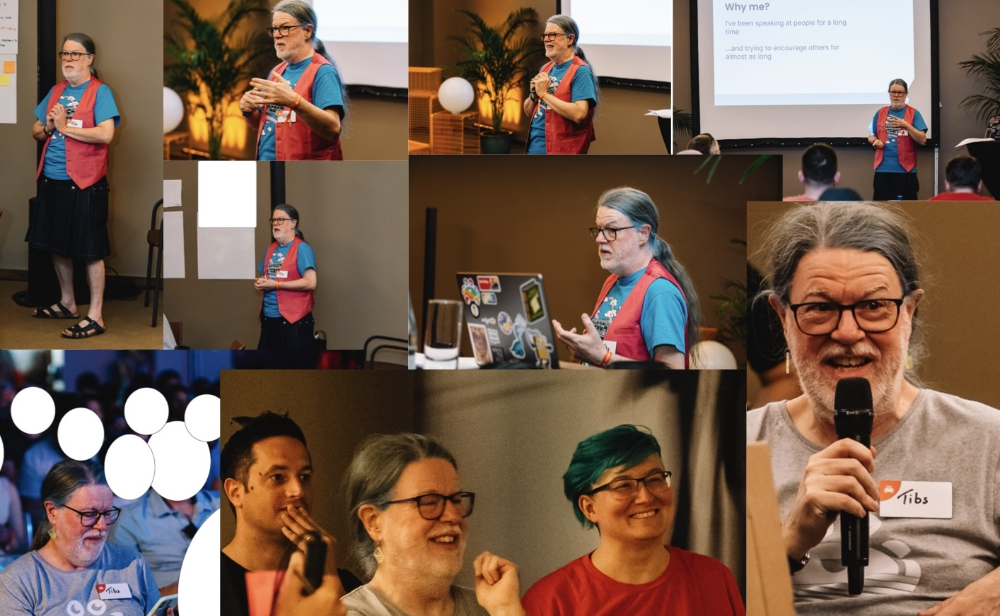

How I used PostgreSQL\ :sup:`®` to find pictures of me at a party
==================================================================

.. class:: title-slide-info

    By Tibs (they / he)

    .. raw:: pdf

       Spacer 0 10

    Slides and source code at
    https://github.com/aiven-labs/pgvector-find-faces-talk

    .. .. raw:: pdf

       Spacer 0 5

    .. image:: images/qr-pgvector-find-faces-github.png
       :scale: 50%

.. footer::

   *tony.ibbs@aiven.io* / *https://aiven.io/tibs*  / *@much_of_a*

   .. Add a bit of space at the bottom of the footer, to stop the underlines
      running into the bottom of the slide
   .. raw:: pdf

      Spacer 0 1

.. -----------------------------------------------------------------------------

.. The image won't fit on this page/slide, so will spill onto the next
   ...which is actually what I want

   Should this go here (to give motivation) or before the "was this a success"
   slide (as it does in the notes)?

Broad structure
---------------

Introduction and vague background

Not an explanation of ML

Finding pictures of me

Why PostgreSQL\ :sup:`®`.

Part the first: Introduction and vague background
-------------------------------------------------

I'm a recovering AI skeptic

I lived through the `AI boom`_ in the 1980s, and the subsequent `AI winter`_ of the 1990s

But we did get expert systems, knowledge based systems, etc. - they just dropped the name "AI"

.. _`AI boom`: https://en.wikipedia.org/wiki/History_of_artificial_intelligence#Boom_(1980%E2%80%931987)
.. _`AI winter`: https://en.wikipedia.org/wiki/AI_winter

My colleagues had been convincing me
------------------------------------

* Quick prototypes of boring code
* Rewrite this paragraph a different way

But what first really caught my interest was this use case, finding my face,
which is based on a tutorial by `Francesco Tisiot`_

..
    Since then, I've found other compelling use cases, including:

    * Search and RAG patterns (Retrieval Augmented Generation)
    * Multi-modal comparisons - comparing text, audio, image and video.

Part the second: not an explanation of ML
-----------------------------------------

.. figure:: images/markus-winkler-f57lx37DCM4-unsplash.jpg
    :width: 43%

    Photo by `Markus Winkler`_ on Unsplash_

.. _`Markus Winkler`: https://unsplash.com/@markuswinkler?utm_source=unsplash&utm_medium=referral&utm_content=creditCopyText

.. _Unsplash: `ML Typewriter`_
.. _`ML Typewriter`:
   https://unsplash.com/photos/f57lx37DCM4?utm_source=unsplash&utm_medium=referral&utm_content=creditCopyText

Not an introduction to vectors and embeddings
---------------------------------------------

ML people talk about vectors and embeddings and vector embeddings.

A vector is an array of numbers representing a direction and a size (or distance).

"Embedding" means representing something in a computer.

So a "vector embedding" is

* an array of numbers representing a direction and size
* stored in a computer.

Not enough about vectors
------------------------

Broadly, we can describe the characteristics of things with numbers.

For instance, we can describe colours with RGB values.

A 3d graph showing a vector (5, 8, 3)
-------------------------------------

.. figure:: images/3d-vector.png
   :width: 30%

   Image from `JCC Math.Phys 191: The vector class`_, `CC BY-SA 3.0`_

We can do mathematics with vectors
----------------------------------

We can compare their

* length
* direction

and we can do maths between vectors - for instance

* "is the vector between colour 1 and colour 2 *similar to* the vector
  between colour 3 and colour 4"

How do we calculate the vectors?
--------------------------------

Back in the early days of Natural Language Processing, this was done by hand.

Nowadays we use Machine Learning and especially Large Language Models.

Calculating the vectors by hand: early NLP
------------------------------------------

In early Natural Language Processing, words would be categorised by hand.

* ``king`` -> ``[1, 1, 0.8, ...]``
* ``queen`` -> ``[1, 0, 0.7, ...]``
* ``princess`` -> ``[0.9, 0, 0.3, ...]``

gauging "importance", "gender", "typical age" and then other things

This doesn't scale well - but we do know what the "meanings" are, and we can
hope to spot bias

Calculating the vectors by hand: ML
-----------------------------------

With ML, we can

* *train* a machine learning system
* to *"recognise"* that a thing belongs to particular categories.

And the "thing" can be more than just words

This is wonderful - but sometimes leads to surprising results, because we
don't know what the meanings *"chosen"* actually are

Part the third: Finding pictures of me
--------------------------------------

.. raw:: pdf

    Spacer 0 10

.. image:: images/slack-picture.jpg

Our aim
-------

Find which files contain my face, using SQL like the following:

.. code:: sql

    SELECT filename FROM pictures
      ORDER BY embedding <-> [0.38162553310394287, ..., 0.20030969381332397]
      LIMIT 10;

Stage 1. Find faces and store their embeddings
----------------------------------------------

.. image:: images/faces-to-pg.png
           :width: 100%

It's not perfect!
-----------------

May not find all the faces

When analysing a group photo, it also found these two faces:

.. raw:: pdf

    Spacer 0 50

.. |not-a-face| image:: images/not-a-face.png
                        :width: 256

.. |not-a-face2| image:: images/not-a-face2.png
                        :width: 256

|not-a-face| |not-a-face2|

768 floating point numbers
--------------------------

Each embedding is an array of 768 floating point numbers.

  ``0.38162553310394287, ..., 0.20030969381332397``

Stage 2. Look for photos with my face in them
---------------------------------------------

.. image:: images/find-nearby-faces.png
           :width: 100%

Using my slack image as the reference face

The program requirements
------------------------

We're going to be using

* `opencv-python`_ to find faces
* imgbeddings_ to calculate embeddings from an image
* the ``haarcascade_frontalface_default.xml``
  file from the `OpenCV GitHub repository`_, which defines the
  pre-trained Haar Cascade model, which we will use to find the faces

My example programs also use click_ and `psycopg2-binary`_

.. _`opencv-python`: https://pypi.org/project/opencv-python/
.. _imgbeddings: https://github.com/minimaxir/imgbeddings
.. _click: https://click.palletsprojects.com/
.. _`psycopg2-binary`: https://pypi.org/project/psycopg2-binary/
.. _`OpenCV GitHub repository`: https://github.com/opencv/opencv/tree/master/data/haarcascades

Enable pgvector
---------------

Enable the pgvector_ extension:

.. code:: sql

   CREATE EXTENSION vector;

This only works if the ``pgvector`` extension is installed.

It may already be available, as in Aiven for PostgreSQL\ :sup:`®`

.. _pgvector: https://github.com/pgvector/pgvector

Create our database table
-------------------------

.. code:: sql

   CREATE TABLE pictures (face_key text PRIMARY KEY, filename text, embedding vector(768));

``face_key`` is the string we use to identify this particular face

``filename`` is the name of the file we found the face in

``embedding`` is the vector itself

Program 1. Find faces and store their embeddings
------------------------------------------------

.. image:: images/faces-to-pg.png
           :width: 100%

Find faces and store their embeddings
-------------------------------------

``find_faces_store_embeddings.py``

::

    Usage: find_faces_store_embeddings.py [OPTIONS] IMAGE_FILES...

    Options:
    -p, --pg-uri TEXT  the URI for the PostgreSQL service, defaulting to
                        $PG_SERVICE_URI if that is set
    --help             Show this message and exit.

Find faces and store their embeddings (1)
-----------------------------------------

.. code:: python

    def main(image_files: tuple[str], pg_uri: str):
        haar_cascade = load_algorithm()
        ibed = imgbeddings()

        for image_file in image_files:
            with psycopg2.connect(pg_uri) as conn:
                orig_image = cv2.imread(image_file, cv2.IMREAD_GRAYSCALE)
                faces = find_faces(orig_image, haar_cascade)

                write_faces_to_pg(faces, orig_image, picture_file, conn, ibed)

``cv2`` is the OpenCV package

Find faces and store their embeddings (2)
-----------------------------------------

.. code:: python

    def load_algorithm():
        algorithm = "haarcascade_frontalface_default.xml"
        haar_cascade = cv2.CascadeClassifier(algorithm)
        if haar_cascade.empty():
            raise GiveUp(f'Error reading algorithm file {algorithm} - no algorithm found')
        return haar_cascade

Find faces and store their embeddings (3)
-----------------------------------------

.. code:: python

        # Read the image in, as greyscale
        orig_image = cv2.imread(image_file, cv2.IMREAD_GRAYSCALE)

Find faces and store their embeddings (4)
-----------------------------------------

.. code:: python

    def find_faces(gray_image, haar_cascade):
        return haar_cascade.detectMultiScale(
            gray_image,
            scaleFactor=1.05,
            minNeighbors=2,
            minSize=(250, 250),
            #minSize=(100, 100),
        )

Find faces and store their embeddings (5)
-----------------------------------------

.. code:: python

    def write_faces_to_pg(faces, orig_image, picture_file, conn, ibed):
        file_path = Path(picture_file)
        file_base = file_path.stem
        file_posix = file_path.as_posix()

        for x, y, w, h in faces:
            # Convert to a Pillow image since that's what imgbeddings wants
            cropped_image = Image.fromarray(orig_image[y: y + h, x: x + w])
            embedding = ibed.to_embeddings(cropped_image)[0]
            face_key = f'{file_base}-{x}-{y}-{w}-{h}'

            write_to_pg(conn, face_key, file_posix, embedding)

Find faces and store their embeddings (6)
-----------------------------------------

And here's where we actually write to PostgreSQL

.. code:: python

    def write_to_pg(conn, face_key, file_name, embedding):
        with conn.cursor() as cur:
            cur.execute('INSERT INTO pictures (face_key, filename, embedding)'
                        ' VALUES (%s,%s,%s)'
                        ' ON CONFLICT (face_key) DO UPDATE'
                        '   SET filename = EXCLUDED.filename,'
                        '       embedding = EXCLUDED.embedding'
                        ';',
                        (face_key, file_name, embedding.tolist())
                        )

Find faces and store their embeddings (7)
-----------------------------------------

``ON CONFLICT`` is interesting:

.. code:: sql

     ON CONFLICT (face_key) DO UPDATE
        SET filename = EXCLUDED.filename,
            embedding = EXCLUDED.embedding;

Program 2. Find "nearby" faces
------------------------------

.. image:: images/find-nearby-faces.png
           :width: 100%

Find "nearby" faces
-------------------

``find_nearby_faces.py``

::

    Usage: find_nearby_faces.py [OPTIONS] FACE_FILE

    Options:
    -n, --number-matches INTEGER
    -p, --pg-uri TEXT             the URI for the PostgreSQL service, defaulting
                                  to $PG_SERVICE_URI if that is set
    --help                        Show this message and exit.

Find "nearby" faces (1)
-----------------------

.. code:: python

    def main(face_file: tuple[str], number_matches: int, pg_uri: str):
        haar_cascade = load_algorithm()
        ibed = imgbeddings()

        # Calculate the embedding for the face file - we assume only one face
        embedding = calc_reference_embedding(face_file, haar_cascade, ibed)

        # Convert to something that will work in SQL
        vector_str = ", ".join(str(x) for x in embedding.tolist())
        vector_str = f'[{vector_str}]'

        ask_pg_and_report(pg_uri, vector_str, number_matches)

Find "nearby" faces (2)
-----------------------

.. code:: python

    def calc_reference_embedding(face_file, haar_cascade, ibed):
        orig_image = cv2.imread(picture_file, cv2.IMREAD_GRAYSCALE)
        faces = find_faces(orig_image, haar_cascade)

        # We hope there's only one face!
        cropped_images = []
        for x, y, w, h in faces:
            cropped_images.append(orig_image[y : y + h, x : x + w])

        face = Image.fromarray(cropped_images[0])
        return ibed.to_embeddings(face)[0]

Find "nearby" faces (3)
-----------------------

In fact, in the real code it doesn't say:

.. code:: python

        # We hope there's only one face!

I couldn't resist an actual check:

.. code:: python

        if len(faces) == 0:
            raise GiveUp(f"Didn't find any faces in {face_file}")
        elif len(faces) > 1:
            raise GiveUp(f"Found more than one face in {face_file}")

Find "nearby" faces (4)
-----------------------

Our embedding needs turning into something that SQL will understand:

.. code:: python

    vector_str = ", ".join(str(x) for x in embedding.tolist())
    vector_str = f'[{vector_str}]'

Find "nearby" faces (5)
-----------------------

.. code:: python

    def ask_pg_and_report(pg_uri, vector_str, number_matches):
        with psycopg2.connect(pg_uri) as conn:
            with conn.cursor() as cur:
                cur.execute(
                    "SELECT filename FROM pictures ORDER BY embedding <-> %s LIMIT %s;",
                    (vector_str, number_matches)
                )
                rows = cur.fetchall()
            print(f'Number of results: {len(rows)}')
            for index, row in enumerate(rows):
                print(f'  {index}: {row[0]}')

Find "nearby" faces (6)
-----------------------

That SQL operator:

.. code:: sql

    SELECT filename FROM pictures
      ORDER BY embedding <-> [0.38162553310394287, ..., 0.20030969381332397]
      LIMIT 10;

* `<->` finds the nearest results by L2 (euclidean) distance.
* `<=>` uses cosine similarity - it compares the angle/direction
* `<#>` computes the inner product - do the vectors point the same way
* `<+>` computes the L1 ("Manhattan" or "taxi cab") distance

But how good is it?
-------------------

Wednesday at Crab Week
~~~~~~~~~~~~~~~~~~~~~~

There were 779 photos, and 5006 faces.

Going through them manually, I found 25 that had me in them.

 * some were in a crowd or obscured,
 * three were of my back (!)
 * two were with a false moustache

Running the programs
--------------------

::

  $ ./find_faces_store_embeddings.py ~/data/crab-week-2023-wednesday/*

11 to 21 minutes to calculate and store the embeddings

::

  $ ./find_nearby_faces.py slack-picture.jpg -n 10

3 seconds to find the 10 nearest faces

Results the program found
-------------------------

And here are the first 10 matches from the program (9 are me)

::

    AIVEN2752.jpg -- just me
    AIVEN2839.jpg -- just me
    AIVEN2838.jpg -- just me
    AIVEN2806.jpg -- me in front of audience
    AIVEN2808.jpg -- just me, from side
    AIVEN2750.jpg -- me plus another
    AIVEN2751.jpg -- me plus others
    AIVEN2748.jpg -- me plus others
    AIVEN2681.jpg -- me in group sitting
    AIVEN3104.jpg -- not me, beard and glasses

The first: AIVEN2752
--------------------

.. image:: images/AIVEN2752.jpeg
           :width: 24%

Me in a group
-------------

.. image:: images/AIVEN2751.png
           :width: 53%

Thursday at Crab Week
---------------------

There were 574 photos and 3486 faces.

Going through them manually, I found 7 that had my face visible

* although in 4 of them I had dark glasses

Results the program found
-------------------------

And here are the first 10 matches from the program (3 are me)

::

   AIVEN3933.jpg  -- me in audience looking down, slightly sideways
   AIVEN3697.jpg  -- me in group
   AIVEN3670.jpg  -- not me, but sort of understandable - beard & glasses
   AIVEN3760.jpg  -- not me, but sort of understandable - beard & glasses
   AIVEN3671.jpg  -- not me, but sort of understandable - beard & glasses
   AIVEN3739.jpg  -- me in group as in the tutorial
   AIVEN3673.jpg  -- not me, but sort of understandable - beard & glasses
   AIVEN3999.jpg  -- not me, but sort of understandable - beard & glasses
   AIVEN4316.jpg  -- not me, but sort of understandable - beard & (dark) glasses
   AIVEN3679.jpg  -- not me, but sort of understandable - beard & glasses

The first: AIVEN3933
--------------------

.. image:: images/AIVEN3933.png
           :width: 53%

As in the tutorial: AIVEN3739 (cropped)
---------------------------------------

.. image:: images/AIVEN3739-cropped.jpg
           :width: 55%

So was this a success, so far?
------------------------------

Definitely yes.

I learnt a lot.

I got not awful (!) results with really very low effort.

I know what to do for the next set of investigations

What I'd do next
----------------

Improve ``find_faces_store_embeddings.py``:

* Add switches to allow playing with the "face detecting" parameters
* Store the results for different parameters in different tables
* Add a switch to store my "reference face"

Improve ``find_nearby_faces.py``

* Add a switch to choose the "reference face" from the database
* Add a switch to specify which table to search

Part the fourth: Why PostgreSQL?
--------------------------------

.. raw:: pdf

    Spacer 0 10

.. image:: images/PostgreSQL_logo.3colors.120x120.png
           :width: 30%

Why is PostgreSQL a surprising choice?
--------------------------------------

We expect Python to be a good fit for exploring ML

But PostgreSQL isn't a dedicated vector database

So why PostgreSQL?
------------------

.. |hammer| image:: images/hammer-159639_1280.webp
                    :align: middle
                    :width: 256

.. |swiss-army-knife| image:: images/swiss-army-knife-154314_1280.png
                    :align: middle
                    :width: 500

.. raw:: pdf

   Spacer 0 50

|swiss-army-knife| and/or |hammer|

.. raw:: pdf

   Spacer 0 45

Images from https://pixabay.com/, by `OpenClipart-Vectors`_

It's significantly better than nothing
--------------------------------------

(faint praise indeed)

There comes a point when you need to store your embeddings in some sort of database

PostgreSQL is a *good* place to start

We already have it
------------------

Quite often, we're already running PostgreSQL

It can SQL all the things
-------------------------

This can be *really useful*:

    Find me things like <this order>, that are in stock

    Find the pictures of me taken in Portugal, between <these dates>

    Find things that match <these qualities>, and choose the one most
    like <this other thing>

PostgreSQL optimisation techniques work
---------------------------------------

You can use all the techniques you normally use in PG to optimise the query

and can do ANALYZE on the query, too

Indexing
--------

Speeds up the *use* of embeddings, but gives *approximate* results.

IVFFlat: Inverted File with Flat Compression

  Slower to search, quicker to build, smaller index, needs rebuilding

HNSW: Hierarchical Navigable Small Worlds

  Faster to search, slower to build, adapts to new data

So why PostgreSQL? - A recurring pattern
----------------------------------------

As Python programmers, we should recognise this pattern:

* Work in Python until it's not suitable,

  and *then* move to something else

  .. raw:: pdf

     Spacer 0 10

* Work in PostgreSQL until it's not suitable,

  and *then* move to something else

When not to use PG?
-------------------

When it can't cope

When it doesn't actually do what you want

When vectors are too big
------------------------

The `pgvector Reference`_ section says:

  Vectors can have up to 16,000 dimensions.

although for Sparsevec, that's "up to 16,000 non-zero elements"

.. _`pgvector Reference`: https://github.com/pgvector/pgvector#reference

When vectors are too big to index
---------------------------------

According to the `pgvector FAQ`_

  You can't currently **index** a vector if it has more than 2,000 dimensions

(but there are techniques to work around this)

.. _`pgvector FAQ`: https://github.com/pgvector/pgvector#frequently-asked-questions

When there are too many vectors for a table
-------------------------------------------

According to the `pgvector FAQ`_

  A non-partitioned table has a limit of 32 TB by default in Postgres. A
  partitioned table can have thousands of partitions of that size.

When you need more speed
------------------------

pgvector is ultimately limited by being based on a relational database that is
not, itself, optimised for this task.

Remember to profile!

When you need a missing distance function
-----------------------------------------

Although this can change...

...for instance, the addition of ``<+>`` (L1 distance) in 0.7.0

When the queries aren't SQL
---------------------------

Relational databases and SQL aren't always the best solution.

For instance, the following (also supported by Aiven :) support vector search:

* OpenSearch - document store with powerful indexing and search
* ClickHouse - columnnar database (actually does support SQL)
* Dragonfly - key/value store (Redis protocol)

And there are currently lots of (dedicated) vector databases out there.

.. Other tools

    Is pgvector the only PostgreSQL solution?

    Neon_ provides pg_embedding_, which uses an HNSW index

    There's `an article by them`_ comparing its performance with pgvector HNSW

    .. _Neon: https://neon.tech/
    .. _pg_embedding: https://github.com/neondatabase/pg_embedding
    .. _`an article by them`: https://neon.tech/blog/pgvector-meets-hnsw-index

The future is bright (judging from history)
-------------------------------------------

`Vectors are the new JSON in PostgreSQL`_ by `Jonathan Katz`_

.. _`Vectors are the new JSON in PostgreSQL`: https://jkatz05.com/post/postgres/vectors-json-postgresql/
.. _`Jonathan Katz`: https://jkatz05.com/

Things will get better and faster and support larger vectors over the next few years.

(I'm also reminded of large blob support - which led to TOAST_, The Oversized-Attribute Storage Technique)

.. _TOAST: https://www.postgresql.org/docs/current/storage-toast.html

.. -----------------------------------------------------------------------------

.. _`OpenClipart-Vectors`: https://pixabay.com/users/openclipart-vectors-30363/

.. _`JCC Math.Phys 191: The vector class`: http://jccc-mpg.wikidot.com/the-vector-class
.. _`CC BY-SA 3.0`: https://creativecommons.org/licenses/by-sa/3.0/

.. _`Francesco Tisiot`: https://aiven.io/francesco

.. -----------------------------------------------------------------------------

.. raw:: pdf

    PageBreak twoColumnNarrowRight

Fin
---

Postgres, PostgreSQL and the Slonik Logo are trademarks or registered
trademarks of the PostgreSQL Community Association of Canada, and used with
their permission

Get a free trial of Aiven services at https://go.aiven.io/europython-signup

.. Also, we're hiring! See https://aiven.io/careers

..
    |cc-attr-sharealike| This slideshow is released under a
    `Creative Commons Attribution-ShareAlike 4.0 International License`_

Slides and accompanying material |cc-attr-sharealike| at
https://github.com/aiven-labs/pgvector-find-faces-talk

.. raw:: pdf

   FrameBreak

.. raw:: pdf

   Spacer 0 85

.. .. raw:: pdf

   Spacer 0 20

.. If I have both QR codes, my phone won't reliably allow selecting the top one
.. .. image:: images/qr-pgvector-find-faces-github.png
    :align: right
    :scale: 55%

.. And that's the end of the slideshow

.. |cc-attr-sharealike| image:: images/cc-attribution-sharealike-88x31.png
   :alt: CC-Attribution-ShareAlike image
   :align: middle

.. _`Creative Commons Attribution-ShareAlike 4.0 International License`: http://creativecommons.org/licenses/by-sa/4.0/

.. _reStructuredText: http://docutils.sourceforge.net/docs/ref/rst/restructuredtext.html
.. _rst2pdf: https://rst2pdf.org/
.. _Aiven: https://aiven.io/
